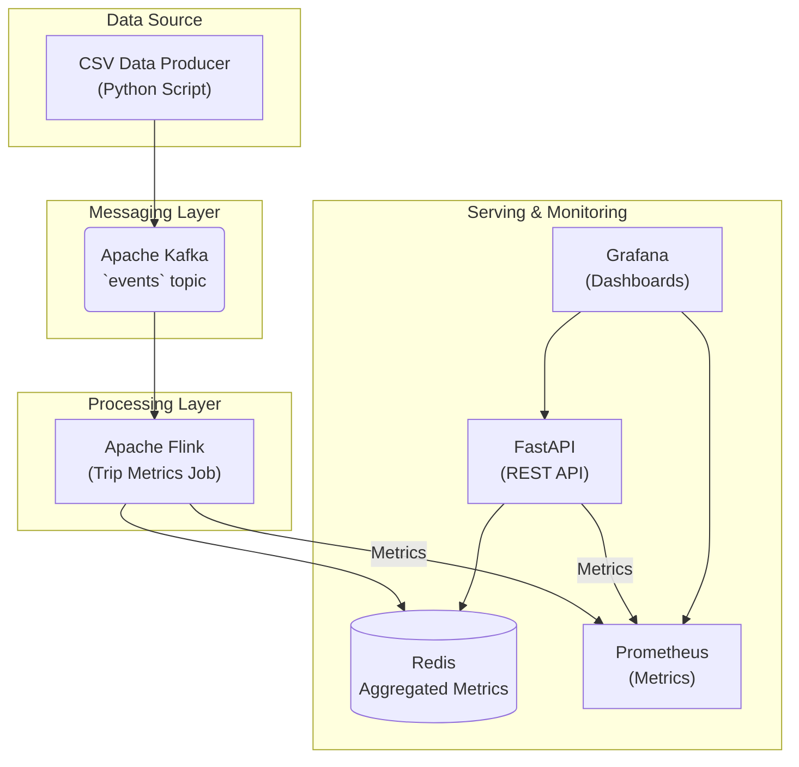

# StreamPulse v1 - Real-time Data Pipeline

[](https://opensource.org/licenses/MIT)
[](https://www.docker.com/)
[](https://flink.apache.org/)
[](https://kafka.apache.org/)
[](https://deepwiki.com/Trantuan24/StreamPulse-v1-Single-Source-Metrics)

> **Level 1 - StreamMetrics Starter Project**
> A comprehensive real-time data pipeline for learning stream processing fundamentals

StreamPulse is a production-grade, end-to-end data pipeline designed for ingesting, processing, and serving real-time analytics on trip data. Built using modern streaming architecture patterns, it demonstrates enterprise-level stream processing capabilities with comprehensive monitoring and fault tolerance.

---

## 🎯 Project Objectives

- **Ingest**: Read trip data from CSV/JSON sources and publish to Kafka with proper partitioning
- **Processing**: Utilize Apache Flink for real-time event-time processing with windowing and watermarks
- **Serving**: Store aggregated results in Redis and expose through FastAPI with comprehensive validation
- **Monitoring**: Track pipeline health and business metrics with Prometheus + Grafana integration

## ✨ Key Features

- **Real-Time Processing**: Utilizes Apache Flink for low-latency, event-time based stream processing with exactly-once semantics.
- **Scalable & Resilient**: Built on Apache Kafka for durable messaging and designed for high throughput and fault-tolerance.
- **High-Performance Serving**: Uses Redis for fast in-memory storage and a FastAPI backend for quick, asynchronous data retrieval.
- **Comprehensive Monitoring**: Integrated with Prometheus and Grafana for deep insights into both system health and business metrics.
- **Containerized**: Fully containerized with Docker Compose for consistent development and production environments.
- **Developer Friendly**: Simplified setup and operations using a `Makefile` for common tasks.

---

## 🏛️ Architecture

The pipeline follows a classic stream processing architecture, ensuring data flows efficiently from ingestion to presentation.



---

## 🛠️ Technology Stack

- **Message Bus**: Apache Kafka (with Zookeeper)
- **Stream Processing**: Apache Flink (JobManager + TaskManager)
- **Serving Layer**: Redis (in-memory key-value store)
- **API Layer**: FastAPI (Python with Pydantic validation)
- **Monitoring**: Prometheus + Grafana + Alertmanager
- **Deployment**: Docker Compose (production-ready containers)

## 📁 Project Structure

```
streampulse/
├── infra/
│   └── docker-compose/          # Docker Compose configurations
├── streaming/
│   ├── flink-jobs/              # Flink applications
│   └── schemas/                 # Data schemas (Pydantic models)
├── producers/
│   └── replay/                  # CSV replay producers
├── serving/
│   └── api/                     # FastAPI application
├── monitoring/
│   ├── prometheus.yml           # Prometheus configuration
│   ├── grafana-dashboards/      # Grafana dashboard definitions
│   └── alerts/                  # Alert rules
├── ops/
│   ├── Makefile                 # Automation scripts
│   ├── scripts/                 # Utility scripts
│   └── data/                    # Sample data files
└── docs/                        # Comprehensive documentation
```

---

## 🚀 Getting Started

This section provides a brief overview of how to get the project running. For detailed steps, please see the **[Getting Started Guide](./docs/getting-started.md)**.

### Prerequisites

- **Docker**: Docker Desktop with Docker Compose support
- **Python**: Version 3.9 or higher
- **Make**: Command-line utility (standard on Linux/macOS, install via Git Bash/WSL on Windows)
- **Git**: For cloning the repository

### Quick Start

1.  **Clone the repository** and navigate into the directory.
2.  **Create and activate a Python virtual environment**.
3.  **Install dependencies**:
    ```bash
    pip install -r serving/api/requirements.txt
    pip install -r producers/replay/requirements.txt
    ```
4.  **Navigate to the `ops/` directory**: `cd ops`
5.  **Run the setup command**: `make clean && make setup`

This will build all images, start the services, create Kafka topics, and submit the Flink job.

---

## ⚙️ Usage

All `make` commands should be run from the `ops/` directory.

- **Start the entire pipeline**:

  ```bash
  make setup
  ```

- **Produce sample data**:

  ```bash
  make produce-test
  ```

- **Test the API endpoint**:

  ```bash
  make test-api
  ```

- **View logs**:

  ```bash
  make logs       # All services
  make logs-flink # Only Flink
  ```

- **Shut down the pipeline**:
  ```bash
  make down
  ```

---

## 📊 Monitoring & Service Access

Once the pipeline is running, you can access the following interfaces:

| Service               | URL                          | Credentials | Description                      |
| --------------------- | ---------------------------- | ----------- | -------------------------------- |
| **FastAPI Docs**      | http://localhost:8000/docs   | -           | Interactive API documentation    |
| **API Health Check**  | http://localhost:8000/health | -           | System health status             |
| **Flink Web UI**      | http://localhost:8081        | -           | Stream processing job monitoring |
| **Grafana Dashboard** | http://localhost:3000        | admin/admin | Business metrics dashboards      |
| **Prometheus**        | http://localhost:9090        | -           | Raw metrics and alerting rules   |

---

## 📊 Data Schema & API

### Sample Data Schema

```json
{
  "trip_id": "trip_001",
  "region_id": 1,
  "event_time": "2025-08-15T10:30:00Z",
  "fare": 25.5,
  "duration": 1800,
  "distance": 12.5
}
```

### 🔌 API Endpoints

| Method | Endpoint                                | Description                           |
| ------ | --------------------------------------- | ------------------------------------- |
| `GET`  | `/metrics/region/{region_id}?window=1m` | Get metrics by region and time window |
| `GET`  | `/health`                               | Health check endpoint                 |
| `GET`  | `/metrics`                              | Prometheus metrics endpoint           |
| `GET`  | `/docs`                                 | Interactive API documentation         |

---

## 🔧 Troubleshooting

| Issue                | Solution                                     |
| -------------------- | -------------------------------------------- |
| **Service Failures** | Check `make logs`, verify container health   |
| **High Latency**     | Monitor Flink backpressure, tune parallelism |
| **Memory Issues**    | Increase limits in docker-compose.yml        |

See [Troubleshooting Guide](docs/troubleshooting.md) for detailed solutions.

---

## 📚 Documentation

| Document                                   | Description                                |
| ------------------------------------------ | ------------------------------------------ |
| [Architecture Guide](docs/architecture.md) | Technical architecture and design overview |
| [Getting Started](docs/getting-started.md) | Detailed setup and installation guide      |
| [API Reference](docs/api-guide.md)         | Complete API documentation with examples   |
| [Monitoring Guide](docs/monitoring.md)     | Grafana dashboards and alerting setup      |
| [Troubleshooting](docs/troubleshooting.md) | Common issues and debugging procedures     |

---

## 📊 Business Metrics & Performance

**Key Analytics**: Trip volume, revenue analytics, duration patterns by region  
**Performance**: End-to-end latency ≤ 3s, 10K+ events/sec throughput  
**Reliability**: Zero data loss with exactly-once processing

---

## 🚀 Next Steps

After mastering Level 1, consider progressing to:

- **Level 2**: Multi-stream joins, OLAP analytics, Schema Registry
- **Level 3**: Kubernetes deployment, HA setup, advanced security

---

## 🤝 Contributing

Contributions are welcome! Please:

1. Fork the repository and create a feature branch
2. Follow existing coding standards and add tests
3. Update documentation for user-facing changes
4. Submit a Pull Request with clear description

---

## 📄 License

MIT License - see [LICENSE](./LICENSE) file for details.

---

## 🙏 Acknowledgments

- [Apache Flink Community](https://flink.apache.org/) - Stream processing engine
- [Apache Kafka](https://kafka.apache.org/) - Distributed streaming platform
- [FastAPI Framework](https://fastapi.tiangolo.com/) - Modern Python web framework
- [Grafana Labs](https://grafana.com/) - Observability and monitoring platform

**StreamPulse** - _Real-Time Analytics Made Simple_ 🚀
