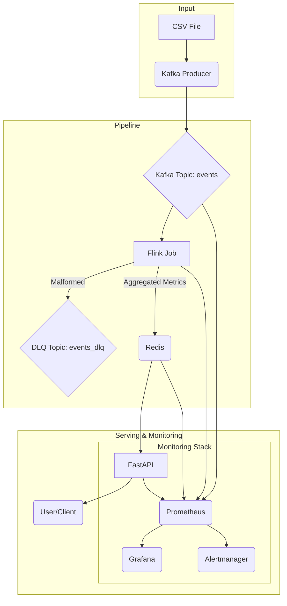

# StreamPulse v1 - Architecture Overview

**Version**: 1.0
**Last Updated**: August 2025

---

## System Overview

StreamPulse v1 is a production-grade real-time data processing pipeline designed for processing trip analytics with sub-second latency requirements. The system implements modern streaming architecture patterns with proper event-time processing, fault tolerance, and comprehensive monitoring.

### Core Objectives

- **Real-time Processing**: Sub-3 second end-to-end latency for trip metrics
- **High Throughput**: Support 10,000+ events per second
- **Fault Tolerance**: Zero data loss with automatic recovery capabilities
- **Scalability**: Horizontal scaling across all pipeline components
- **Observability**: Complete visibility into system health and performance

---

## Architecture Components

### Data Ingestion Layer

**Apache Kafka** serves as the primary message broker, providing durable, partitioned event streaming with the following characteristics:

- **Topic**: `events` (trip data) and `events_dlq` (failed events)
- **Partitioning**: By region_id for balanced load distribution
- **Replication**: Configurable replication factor for high availability
- **Retention**: Configurable retention policies for data governance

### Stream Processing Layer

**Apache Flink** handles all real-time stream processing with sophisticated event-time semantics:

- **Event-time Processing**: Uses event timestamps rather than processing time
- **Watermark Strategy**: 5-minute tolerance for out-of-order events
- **Windowing**: 1-minute tumbling windows for continuous aggregations
- **State Management**: RocksDB state backend for large-scale state handling
- **Checkpointing**: 30-second intervals for exactly-once processing guarantees

### Data Serving Layer

**Redis** provides high-performance in-memory storage optimized for real-time queries:

- **Key Pattern**: `region:{id}:window:{timestamp}` for efficient lookups
- **Data Format**: JSON-serialized metrics with configurable TTL
- **Connection Pooling**: Optimized connection management for high concurrency
- **Persistence**: Optional AOF persistence for data durability

### API Layer

**FastAPI** delivers RESTful access to processed metrics with enterprise-grade features:

- **Health Monitoring**: Multi-service dependency health checks
- **Connection Management**: Async connection pooling with proper lifecycle handling
- **Data Validation**: Pydantic models for request/response validation
- **Error Handling**: Comprehensive error responses with proper HTTP status codes
- **Metrics Exposure**: Prometheus metrics for API performance monitoring

### Monitoring Stack

**Prometheus + Grafana** provides comprehensive observability across all components:

- **Metrics Collection**: JMX exporters for Kafka/Flink, native exporters for Redis/API
- **Visualization**: Pre-built dashboards for business and system metrics
- **Alerting**: Alertmanager integration with configurable alert rules
- **Data Retention**: Configurable retention policies for historical analysis

---

## Data Flow Architecture

### Primary Data Path

1. **Event Production**: CSV data replayed through Kafka producer with preserved event-time
2. **Stream Ingestion**: Flink consumes events from Kafka topic with proper backpressure handling
3. **Data Validation**: JSON parsing with malformed events routed to Dead Letter Queue
4. **Stream Processing**: Event-time windowing with region-based keyed streams
5. **Aggregation**: Real-time calculation of trip counts, averages, and percentiles
6. **Result Storage**: Metrics stored in Redis with structured key patterns
7. **API Serving**: FastAPI serves aggregated metrics via RESTful endpoints

### Error Handling Path

- **Parsing Failures**: Malformed JSON routed to `events_dlq` topic with enriched metadata
- **Processing Errors**: Flink restart strategy with exponential backoff
- **Storage Failures**: Redis connection resilience with automatic retry logic
- **API Errors**: Graceful degradation with appropriate error responses

### Data Flow Diagram

---

## Scalability Considerations

### Horizontal Scaling

- **Kafka**: Multiple brokers with partition rebalancing
- **Flink**: Multiple TaskManagers with configurable parallelism
- **Redis**: Cluster mode with sharding strategies (future enhancement)
- **API**: Multiple FastAPI instances behind load balancer

### Performance Optimization

- **Batch Processing**: Configurable batch sizes for throughput optimization
- **Memory Management**: Tuned JVM settings for Flink components
- **Network Optimization**: Compression and connection pooling strategies
- **Storage Optimization**: Redis memory policies and eviction strategies

---

## Security Architecture

### Network Security

- **Container Isolation**: Docker network segmentation
- **Service Communication**: Internal service-to-service communication
- **External Access**: Controlled exposure through defined ports only

### Data Security

- **Input Validation**: Comprehensive validation at ingestion and API layers
- **Error Sanitization**: Sensitive data exclusion from error messages
- **Audit Logging**: Comprehensive logging for security monitoring

---

## Deployment Architecture

### Container Orchestration

- **Docker Compose**: Development and single-node deployments
- **Health Checks**: Container-level health monitoring with restart policies
- **Volume Management**: Persistent storage for stateful components
- **Resource Limits**: CPU and memory constraints for resource management

### Environment Configuration

- **Configuration Management**: Environment-based configuration with defaults
- **Secret Management**: Secure handling of sensitive configuration data
- **Service Discovery**: Container name-based service resolution

---

## Monitoring Architecture

### Metrics Collection

- **Application Metrics**: Custom business metrics from Flink job and API
- **Infrastructure Metrics**: System-level metrics from all containers
- **JMX Metrics**: Detailed Kafka and Flink internal metrics
- **Custom Dashboards**: Business-specific visualizations in Grafana

### Alerting Strategy

- **Threshold-based Alerts**: Configurable thresholds for key performance indicators
- **Anomaly Detection**: Statistical analysis for unusual patterns
- **Multi-channel Notifications**: Email, Slack, and webhook integrations
- **Alert Escalation**: Tiered alerting based on severity levels

---

## Future Architecture Enhancements

### Planned Improvements

- **Multi-source Processing**: Join capabilities across multiple data streams
- **Machine Learning Integration**: Real-time feature engineering and model serving
- **Advanced Analytics**: Complex event processing and pattern detection
- **Global Scale**: Multi-region deployment with data replication strategies

### Technology Evolution

- **Kubernetes Migration**: Container orchestration for production environments
- **Schema Registry**: Centralized schema management for data governance
- **Data Lake Integration**: Long-term storage with Apache Iceberg or Delta Lake
- **Advanced Monitoring**: Distributed tracing with OpenTelemetry integration
